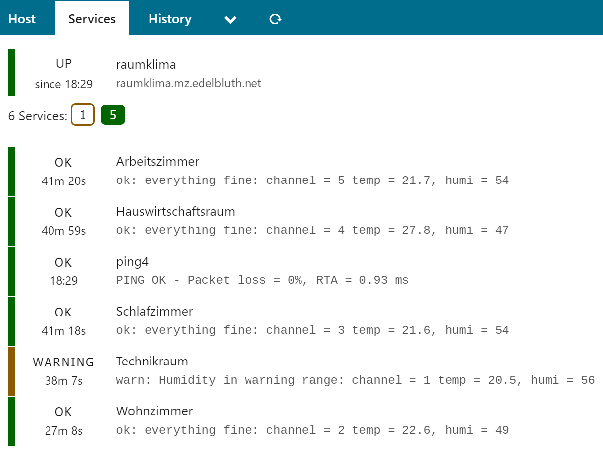

[](https://dependabot.com)

| Branch  | Build Status                                                                                                                                 |
|---------|----------------------------------------------------------------------------------------------------------------------------------------------|
| master  | [](https://travis-ci.org/juergen-rocks/raumklima)     |
| develop | [](https://travis-ci.org/juergen-rocks/raumklima)   |

# ELV Raumklimastation RS 500 bzw. dnt RoomLogg Pro unter Linux auslesen

Der Elektronikversender [ELV](https://www.elv.de/) bot unter der Artikelnummer [68-12 87 19](https://www.elv.de/elv-raumklimastation-rs500-inkl-5-sensoren-messwertespeicher-und-pc-auswertesoftware.html) eine Raumklimastation mit 5 Sensoren an, die sich über einen USB-Anschluss am PC auswerten lassen soll.

Dies gilt auch für den Nachfolger "dnt RoomLogg pro", der inzwischen unter der Artikelnummer [25 13 49](https://de.elv.com/dnt-spar-set-funk-raumklimastation-roomlogg-pro-mit-8-thermo-hygrosensoren-und-auswertesoftware-251349) angeboten wird. Eine kurze Diskussion zu "dnt RoomLogg pro" gibt es im Issue [raumklima/#40](https://github.com/juergen-rocks/raumklima/issues/40). Die RoomLogg Pro und die RS 500 sind offensichtlich baugleich.

Beiden liegt eine proprietäre Windows-Software "EasyTemp" bzw. "RoomLogg" bei. Eine Unterstützung für Linux wird nicht angeboten.

__ACHTUNG! Das hier beschriebene Vorgehen kann das Gerät irreparabel schädigen! Hier werden Annahmen getroffen, die sich aufgrund fehlender Dokumentation nicht bestätigen ließen! Es wird keinerlei Support geleistet! Es wird keinerlei Garantie oder Gewährleistung für die korrekte Funktionsweise oder Ungefährlichkeit übernommen.__

__Noch ein Hinweis: Ich habe nichts mit ELV zu tun. Ich habe die Raumklimastation RS 500 nur dort gekauft.__

## Ausführliche Beschreibung im Blog

Etwas ausführlicher als hier und mit mehr Hintergrundinformationen wird die Verwendung der RS 500 mit einem Raspberry Pi hier beschrieben:

- [juergen.rocks: ELV Raumklimastation RS 500 mit Raspberry Pi unter Linux auslesen](https://juergen.rocks/art/elv-raumklimastation-rs500-raspberry-pi-linux.html "juergen.rocks: ELV Raumklimastation RS 500 mit Raspberry Pi unter Linux auslesen")
- [juergen.rocks: ELV Raumklimastation RS 500 mit Icinga 2 auswerten und überwachen](https://juergen.rocks/art/elv-raumklimastation-rs500-icinga2.html "juergen.rocks: ELV Raumklimastation RS 500 mit Icinga 2 auswerten und überwachen")


## Motivation

Die Station ist schick und preiswert. Dennoch würde der Anwender die Daten im Rahmen eines zentralen Monitorings weiter verwenden. So entstand meine persönliche Motivation:

```
                                            +------------> Auswertung mit Icinga (check_rs500.py)
                                            |
  +------------+               +--------------+
  | ELV RS 500 | <--- USB ---> | Raspberry Pi | ---------> Web-Interface zur Live-Abfrage
  +------------+               +--------------+
                                            |
                                            +------------> Anderweitiges Logging
```


## Reverse Engineering

Schließt man die Raumklimastation an den Raspberry Pi (Raspian Stretch) an, so sieht man ein neues Gerät:

```
usb 1-1.3: new full-speed USB device number 5 using dwc_otg
usb 1-1.3: New USB device found, idVendor=0483, idProduct=5750
usb 1-1.3: New USB device strings: Mfr=1, Product=2, SerialNumber=3
usb 1-1.3: Product: By viewtool
usb 1-1.3: Manufacturer: MyUSB_HID
usb 1-1.3: SerialNumber: ************
hid-generic 0003:0483:5750.0005: hiddev0,hidraw0: USB HID v1.10 Device [MyUSB_HID By viewtool] on usb-20980000.usb-1.3/input0
```

Es ist also ein USB-HID-Device der Firma "viewtool". Liest man vom Raw Device, herrscht einfach Stille auf der Leitung. Also automatisch kommen die Messwerte nicht aus der Station.

Das Protokoll ist unbekannt, und so hatte ich keine andere Wahl, als einen Windows-PC zu verwenden, die beigelegte Software "EasyTemp" zu installieren und einen Blick auf die übertragen Daten zu werfen.

Dabei konnte beobachtet werden, dass die Software immer eine Anfrage (4 Bytes, aufgefüllt auf 64 Bytes) schickt  und das Gerät mit 64 Bytes antwortet. Es gibt 7 verschiedene Anfragen, die sich ständig wiederholen, so lange "EasyTemp" läuft.

Um die relevanten Informationen zu finden, habe ich mich zunächst auf einen Sensor reduziert und Mitschnitte angefertigt, während sich die Temperatur ändert.

Änderungen in den Antwort-Daten ergaben sich nur in einer Anfrage, nämlich `0x7B 0x03 0x40 0x7D`. Hier enthielt die Antwort offensichtlich alle relevanten Daten.

Betrachtet man die Antwort, so kann man erkennen, dass offenbar drei Byte für jeden Kanal verwendet werden. Die ersten beiden für die Temperatur, das dritte für die Luftfeuchte. Die ersten zwei Bytes als Integer ergeben das Zehnfache der angezeigten Temperatur (`0x01 0x18` = `280` = `28,0 °C`). Die Luftfeuchte entspricht als Integer der auf dem Display angezeigten (`0x34` = `52` = `52 %`).

Die Station verfügt über 8 Kanäle, ich habe nur 5 Sensoren angeschlossen.

```
                        Kanal 2                       Kanal 4                       Kanal 6                       Kanal 8
                    +--------------+              +--------------+              +--------------+              +--------------+
                    |              |              |              |              |              |              |              |
  ??                |  Temp     RH |              |  Temp     RH |              |  Temp     RH |              |  Temp     RH |
+----+              +---------+----+              +---------+----+              +---------+----+              +---------+----+
|    |              |         |    |              |         |    |              |         |    |              |         |    |
 0x7b 0x00 0xcb 0x35 0x01 0x18 0x28 0x00 0xd6 0x34 0x00 0xff 0x2b 0x00 0xd0 0x35 0x7f 0xff 0xff 0x7f 0xff 0xff 0x7f 0xff 0xff [... mehr Bytes, mit denen ich (noch) nichts anfangen kann ...] 
     |         |    |              |         |    |              |         |    |              |         |    |
     +---------+----+              +---------+----+              +---------+----+              +---------+----+
     |  Temp     RH |              |  Temp     RH |              |  Temp     RH |              |  Temp     RH |
     |              |              |              |              |              |              |              |
     +--------------+              +--------------+              +--------------+              +--------------+
         Kanal 1                       Kanal 3                       Kanal 5                       Kanal 7
```

Nicht verwendete Kanäle haben also den Wert `0x7f 0xff 0xff`. Alles soweit logisch. Wertet man das hier gezeigte Beispiel aus, so kommt man zu diesem Ergebnis:

| Kanal | Temperatur | Luftfeuchte |
|-------|------------|-------------|
| 1     | 20,3 °C    | 53 % rel.   |
| 2     | 28,0 °C    | 40 % rel.   |
| 3     | 21,4 °C    | 52 % rel.   |
| 4     | 25,5 °C    | 43 % rel.   |
| 5     | 20,8 °C    | 53 % rel.   |
| 6     | ---        | ---         |
| 7     | ---        | ---         |
| 8     | ---        | ---         |

Das deckt sich mit den Display-Anzeigen. Doch wie sieht es mit negativen Temperaturen aus? Dazu habe ich extra einen Sensor eingepackt und in die Tiefkühltruhe gelegt und gewartet, bis die Temperatur auf unter 0°C fällt. Das Ergebnis:

| Antwort          | Erwartete Temperatur | Erwartete Luftfeuchte |
|------------------|----------------------|-----------------------|
| `0xff 0xee 0x26` | -1,8 °C              | 38 % rel.             |
| `0xff 0xe7 0x27` | -2,5 °C              | 39 % rel.             |

Bei der Luftfeuchte ergibt sich kein Problem. Warum auch. Hier gibt es sowieso nur positive Werte. Die Temperaturen wären mit `0xff 0xee` = `65518` = `6551,8 °C` (nach bisheriger Annahme) wohl wesentlich zu hoch. Hier nutzt man einen Überlauf. Auf die richtige Temperatur käme man also mit `0xffee - 0xffff - 0x1` = `-18` = `-1,8 °C`.

Zum Glück springt mir hier die Python-Standardbibliothek mit `int.from_bytes` zur Seite:

```python
int.from_bytes([0xff, 0xee], byteorder='big', signed=True)
# Liefert -18 -> das ist das erwartete Ergebnis!
```

Das klappt auch mit den oben schon genannten positiven Werten:

```python
int.from_bytes([0x01, 0x18], byteorder='big', signed=True)
# Liefert 280 -> das ist das erwartete Ergebnis!
```

Soweit zur Theorie. Dann kann man den Spaß nun implementieren.


## Implementierung

Die Implementierung ist jetzt trivial, sie erfolgt in __Python 3.5__. Es gibt die wundervolle [hidapi](https://github.com/gbishop/cython-hidapi), die einen extrem bequemen Zugriff erlaubt.

Diese Module werden nun implementiert:

| Modul       | Verwendung                                                                                                                                                     |
|-------------|----------------------------------------------------------------------------------------------------------------------------------------------------------------|
| rs500reader | Liest die aktuellen Messwerte für Temperatur und Luftfeuchte aus.                                                                                              |
| rs5002redis | Holt alle Messwerte periodisch und schreibt sie in eine Redis-Instanz. Gut als Cache und als Abfragehilfe für WebIF und Icinga-Abfrageskript (`check_rs500`).  |
| check_rs500 | Icinga-Command, welches aus der Redis-Instanz sich die Messwerte wiederholt und entsprechend auswertet.                                                        |


## Was funktioniert?

Temperatur und Luftfeuchte können für alle 8 Kanäle ausgelesen werden.


## Was funktioniert nicht?

Die Software "EasyTemp" kann weit mehr, als einfach nur die Temperaturen und Luftfeuchten auszuwerten. Hier kann die gesamte Station konfiguriert werden. Zusätzlich können Messreihen aufgezeichnet und in eine Tabellenkalkulation exportiert werden.

Mein Ziel lag nur im Auslesen der aktuellen Messwerte. Insofern habe ich mich um den Rest nicht gekümmert.

Außerdem verkraften alle Skripte hier es nicht, wenn mehrere RS 500 angeschlossen sind.


## Wie passt nun alles zusammen?

### Raspberry Pi mit Anschluss an RS 500

Auf einem Raspberry Pi habe folgendes installiert:

- Raspbian Stretch
- make
- gcc
- python3
- python3-dev
- python3-virtualenv
- libusb-1.0-0-dev
- libudev-dev
- redis (Cache für die ausgelesenen Temperaturdaten)
- shorewall (Zugriff auf Redis auf bestimmte IPs limitieren)

Dann wird entsprechend ein virtualenv erzeugt, und im aktivierten Environment folgendes ausgeführt:

- `pip install -r requirements-rs500reader.txt`
- `pip install -r requirements-rs5002redis.txt`

Die Installation von `hidapi` auf einem Raspberry Pi dauert _ewig_. Wirklich.

Dann richte ich einen Cronjob ein, der zwei Mal pro Minute das Skript `start_save_rs500_to_redis.sh` aufruft.

Redis konfiguriere ich so, dass es auch auf die IP-Adresse von `eth0` des Raspberries hört und deaktiviere jegliche Speicherung (alles mit `save` aus der Redis-Konfiguration auskommentieren). Redis-Neustart nicht vergessen.

Dann noch ein bisschen Shorewall konfigurieren, so dass nur mein Monitoring-Host auf die Redis-Instanz zugreifen darf.

Nun wird alle halbe Minute die RS 500 abgefragt und das Ergebnis in Redis abgelegt.

Dazu kann man jetzt noch ein kleines Web-Interface nutzen: [https://github.com/juergen-rocks/raumklima-web](https://github.com/juergen-rocks/raumklima-web)

### Monitoring-Host

Auf dem Monitoring-Host erzeuge ich auch ein virtualenv, und führe im aktivierten Environment dieses aus:

- `pip install -r requirements-check_rs500.txt`

In der Datei `check_rs500.ini` konfiguriere ich den Zugang zur Redis-Instanz auf dem Raspberry Pi.

Im Wiki liegen Konfig-Beispiele für Icinga2.



Das wars.

# Tests durchführen

Die Tests befinden sich in `src/test`. Für die Durchführung der Tests sind die zusätzlichen Abhängigkeiten aus `requirements-test.txt` erforderlich.

Zur Testausführung im Ordner `src` einfach `py.test --cov --cov-report term-missing --cov-config .coveragerc test/` aufrufen.
